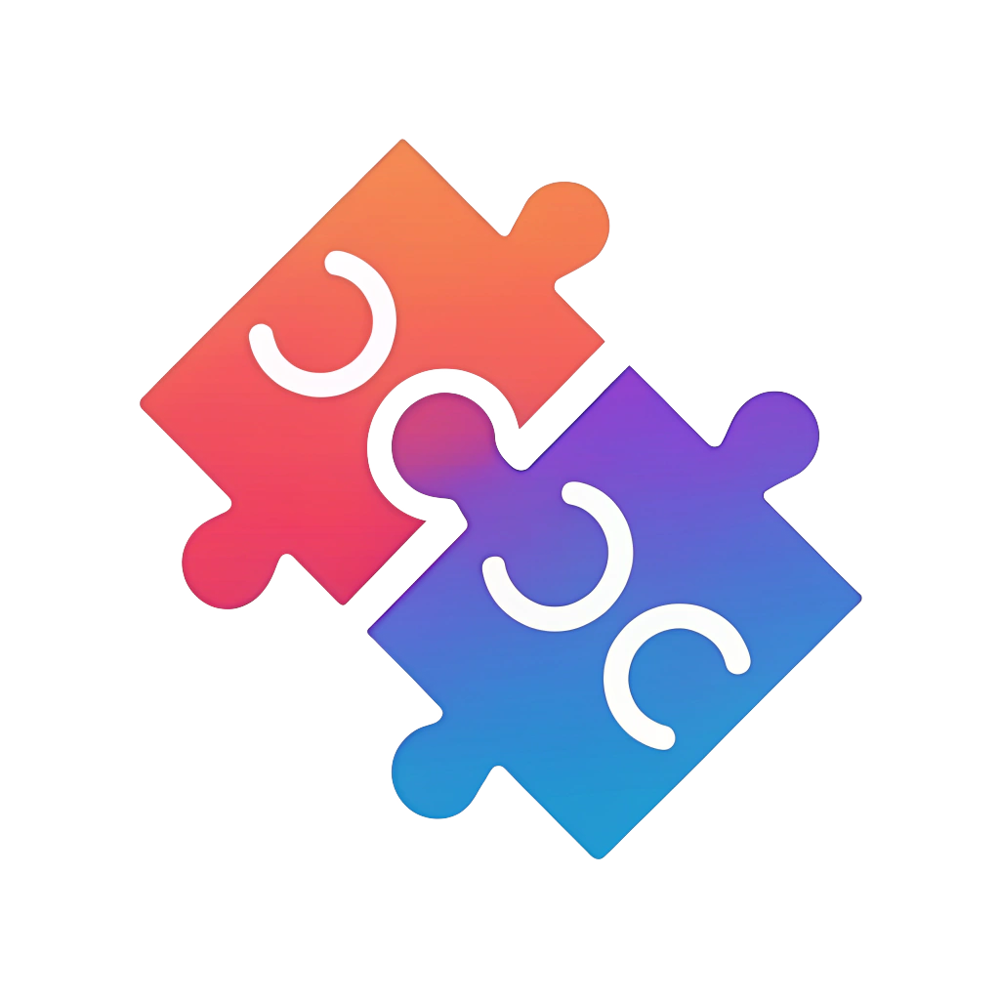

# Perfex CRM Customer Merge Module

[](https://github.com/owgit/customer_merge)
[](https://perfexcrm.com/)
[](LICENSE)

A powerful module for Perfex CRM that allows administrators to merge duplicate customer records while preserving all associated data. Simplify your customer database management by combining duplicate entries without losing any important information.

<p align="center">
  
</p>

## 📋 Table of Contents

- [Features](#features)
- [Requirements](#requirements)
- [Installation](#installation)
- [Usage](#usage)
- [Data Handling](#data-handling)
- [Custom Fields Merging](#custom-fields-merging)
- [Primary Contact Handling](#primary-contact-handling)
- [Permissions](#permissions)
- [Language Support](#language-support)
- [Contributing](#contributing)
- [Changelog](#changelog)
- [Support](#support)
- [License](#license)

## ✨ Features

- **Intuitive Interface**: Simple, user-friendly interface for merging duplicate customers
- **Comprehensive Data Migration**: Preserves all customer-related data during merges
- **Selective Merging**: Choose which data elements to merge
- **Smart Custom Fields Handling**: Intelligently combines values for select-type fields
- **Primary Contact Management**: Smart handling of primary contacts
- **Merge History**: Track all customer merges with detailed logs
- **Permission-Based Access**: Control who can view and perform merges
- **Multilingual Support**: Available in multiple languages (English and Swedish)
- **Rollback Functionality**: Undo merge operations

## 📋 Requirements

- Perfex CRM version 2.3.2 or higher
- PHP 7.3 or higher
- MySQL 5.6 or higher

## 📥 Installation

### Manual Installation

1. **Download** the latest release from the [Releases page](https://github.com/owgit/customer_merge/releases)
2. **Extract** the downloaded ZIP file
3. **Upload** the `customer_merge` folder to the `modules` directory of your Perfex CRM installation
4. **Navigate** to `Setup → Modules` in your Perfex CRM admin panel
5. **Find** the Customer Merge module and click the "Activate" button
6. **Refresh** your browser to complete the installation

### Using Composer

```bash
composer require owgit/customer_merge
```

### Using Git

```bash
cd /path/to/perfex/modules
git clone https://github.com/owgit/customer_merge.git
```

## 🚀 Usage

### Accessing the Module

1. Navigate to `Customers → Customer Merge` in the main menu
2. Alternatively, access the merge function directly from any customer's profile page via the "Merge with another customer" button

### Merging Customers

1. **Select Source Customer**: Choose the customer that will be merged (this customer will be deleted after the merge)
2. **Select Target Customer**: Choose the customer that will receive all the data (this customer will be kept)
3. **Configure Merge Options**: Select which data elements to merge
4. **Review Customer Data**: Optionally select specific customer data fields to transfer
5. **Confirm and Execute**: Review the warning message, check the confirmation box, and click "Merge Customers"

### Viewing Merge History

1. Go to `Customers → Customer Merge`
2. View the list of all merge operations performed

### Rolling Back a Merge

If you need to undo a merge operation:

1. Go to `Customers → Customer Merge`
2. Find the merge operation you want to rollback
3. Click the rollback button (undo icon)
4. Confirm the rollback

The rollback process will:
- Create a new customer with the original source customer name
- Move data created after the merge back to the new customer
- Mark the merge operation as rolled back

**Note:** The rollback process is not a perfect undo. It creates a new customer (with a new ID) and only moves data created after the merge. Data that existed before the merge will remain with the target customer.

## 📊 Data Handling

The following data is migrated during the merge process:

| Data Type | Description |
|-----------|-------------|
| Contacts | All contacts and their permissions |
| Invoices | All invoices and their items |
| Estimates | All estimates and their items |
| Projects | All projects and their tasks |
| Expenses | All expenses and their receipts |
| Payments | All payment records |
| Tasks | All tasks and their comments |
| Notes | All customer notes |
| Files | All uploaded files |
| Contracts | All contracts and their renewals |
| Tickets | All support tickets and their replies |
| Proposals | All proposals and their content |
| Custom Fields | All custom field values with intelligent merging |
| Customer Groups | All group memberships |

## 🔄 Custom Fields Merging

The module features an enhanced custom fields merging system that intelligently handles different field types:

### Select/Multiselect Fields (like "customers_kundtyp")
- Values are combined rather than replaced when both customers have different values
- The system creates a comma-separated list of unique values from both customers
- Special handling for "customers_kundtyp" ensures customer type information is preserved from both records

### Other Field Types
- **Checkboxes**: If source is checked but target isn't, the target will be checked
- **Dates**: The most recent date is kept
- **Text/Textarea**: Text is combined with a separator if both have content
- **Other types**: Source value is used only if target is empty

### Benefits
- No information is lost during merging
- Values are combined in a way that makes sense for each field type
- Detailed logs show exactly what happened during the merge

## 👤 Primary Contact Handling

When merging customers, the primary contact is handled as follows:

- The target customer's primary contact is always preserved as the primary contact
- Any primary contact from the source customer will be transferred but will no longer be marked as primary
- If the target customer has no primary contact, the first transferred contact may be set as primary

## 🔒 Permissions

The module adds two custom permissions:

| Permission | Description |
|------------|-------------|
| View Customer Merge | Allows staff to view the merge history |
| Create Customer Merge | Allows staff to perform customer merges and rollback merges |

By default, only administrators have full permissions. You can modify permissions in `Setup → Staff → Roles`.

## 🌐 Language Support

The module currently supports the following languages:

- English
- Swedish

### Adding a New Language

To add support for additional languages:

1. Create a new directory in `modules/customer_merge/language/` with the language name (e.g., `french`)
2. Copy the `customer_merge_lang.php` file from the `english` directory to your new language directory
3. Translate all strings in the file
4. The module will automatically detect and use the new language file

## 🤝 Contributing

Contributions are welcome! Here's how you can help:

1. **Fork** the repository
2. **Create** a new branch (`git checkout -b feature/amazing-feature`)
3. **Make** your changes
4. **Commit** your changes (`git commit -m 'Add some amazing feature'`)
5. **Push** to the branch (`git push origin feature/amazing-feature`)
6. **Open** a Pull Request

### Development Setup

1. Clone the repository to your local Perfex CRM modules directory
2. Make your changes
3. Test thoroughly before submitting a pull request

### Coding Standards

- Follow the Perfex CRM coding standards
- Use meaningful variable and function names
- Add comments to explain complex logic
- Write unit tests for new features when possible

## 📝 Changelog

### Version 1.0.2 (2025-03-11)
- Added comprehensive rollback functionality for all customer data types
- Enhanced database column detection for better compatibility
- Fixed issues with contacts and primary contacts during rollback
- Improved error handling in rollback process
- Fixed "Unknown column" errors in various tables

### Version 1.0.1 (2023-06-15)
- Added rollback functionality to undo merge operations
- Added status indicators in merge history
- Added Swedish translations for rollback functionality

### Version 1.0.0 (2023-06-01)
- Initial release
- Support for merging all customer data
- Primary contact handling
- Merge history tracking
- Permission-based access control
- English and Swedish language support
- Enhanced custom fields merging with special handling for "customers_kundtyp"

## 🆘 Support

For support, bug reports, or feature requests, please:

- Visit my website at [uygarduzgun.com](https://uygarduzgun.com)
- Email me at [info@uygarduzgun.com](mailto:info@uygarduzgun.com)
- Create an issue on the [GitHub repository](https://github.com/owgit/customer_merge/issues)

## 📄 License

This module is released under the [MIT License](LICENSE).

---

Developed with ❤️ by [Uygar Duzgun](https://uygarduzgun.com) 